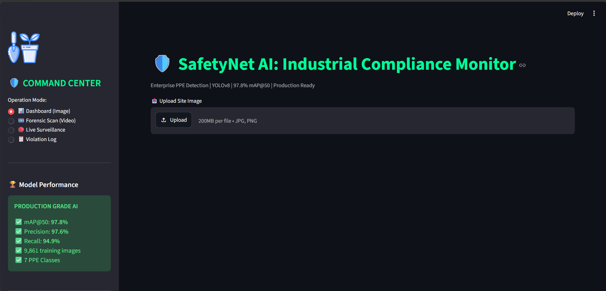
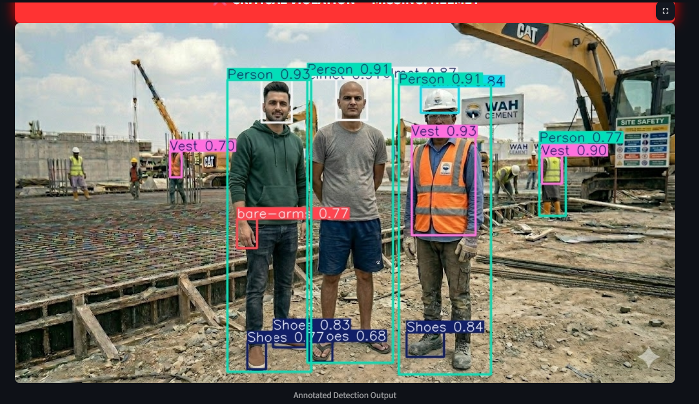
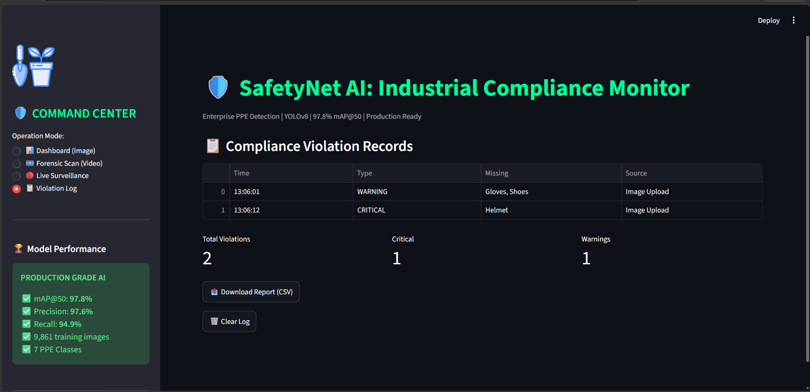
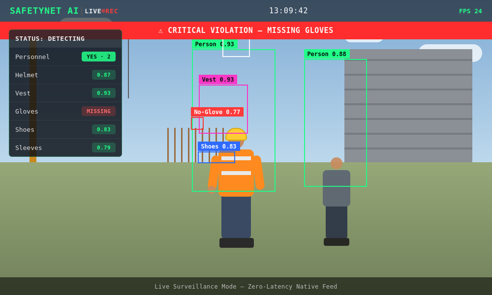

<h1 align="center">🦺 SafetyNet AI</h1>
<h3 align="center">Multi-Modal Construction Safety Compliance System</h3>

<p align="center">
  <b>Enterprise-grade PPE detection with real-time web integration & file analytics — built on YOLOv11.</b>
</p>

<p align="center">
  
  
  
  
  
</p>

<p align="center">
  <b>97.8% mAP@50</b> &nbsp;·&nbsp; <b>97.6% Precision</b> &nbsp;·&nbsp; <b>94.9% Recall</b> &nbsp;·&nbsp; Trained on 9,861 images
</p>

---

## 📖 Abstract

**SafetyNet AI** is an industrial safety solution that monitors Personal Protective Equipment (PPE) compliance on construction sites in real time. It uses **YOLOv11** to detect humans and four essential safety items — **hard hats, safety vests, boots, and gloves** — across a **triple-mode input system**: static images, recorded video, and live webcam feeds.

Unlike basic detection models that only report *what's present*, SafetyNet AI applies **contextual "Smart Compliance Logic"** — cross-referencing each detected person against the required gear list to explicitly flag **what's missing**, and dynamically alerts safety officers through a professional Streamlit dashboard.

---

## ❗ Problem Statement

Construction sites are high-risk environments where PPE non-compliance leads to fatal injuries. Existing monitoring is either manual (slow, expensive, error-prone) or relies on basic single-object detectors that can't handle multiple media formats, provide technical file analytics, or — critically — explain *what safety gear is missing*. SafetyNet AI closes that gap with an automated, production-grade system built for both live and recorded footage.

---

## ✨ Key Features

- 🎯 **5-class detection** — Human, Helmet, Vest, Boots, Gloves via YOLOv11
- 🧠 **Smart Missing-Gear Logic** — cross-references bounding boxes to flag exactly which required item is absent on each person, not just what's detected
- 🖼️ **Triple-mode input** — upload an image, analyze a video, or run a live webcam feed
- 📊 **Automated file diagnostics** — extracts resolution, file size, type, and FPS automatically using OpenCV & PIL
- 🚨 **Dynamic violation banners** — real-time on-screen alerts (e.g. *"CRITICAL VIOLATION — MISSING GLOVES"*)
- 📋 **Violation logging** — timestamped compliance records with severity level (Warning / Critical), exportable as CSV
- ⚡ **Hybrid UI architecture** — Streamlit web dashboard for media analytics, native OpenCV window for zero-latency live camera feeds

---

## 📸 Preview

**Command Center Dashboard**
<p align="center"></p>

**Annotated Detection Output**
<p align="center"></p>

**Compliance Violation Log**
<p align="center"></p>

**Live Surveillance Mode**
<p align="center"></p>

---

## 🧠 Model Performance

| Metric | Score |
|---|---|
| mAP@50 | **97.8%** |
| Precision | **97.6%** |
| Recall | **94.9%** |
| Training Images | 9,861 |
| Classes | 7 PPE classes |
| Architecture | YOLOv11n (Nano) |
| Training Hardware | Google Colab — Tesla T4 GPU, 30 epochs |

---

## 📊 Dataset

- **Source:** Roboflow Universe — *"Personal Protective Equipment"* by Rafi Akbar
- **Size:** 2,092 annotated images
- **Format:** YOLO-format multi-class labels
- **Classes (5):** Human, Helmet, Vest, Boots, Gloves

---

## 🔄 Methodology

```
1. Data Acquisition     → High-accuracy PPE dataset from Roboflow
2. Model Training       → YOLOv11n on Google Colab (Tesla T4 GPU, 30 epochs, >90% mAP target)
3. Metadata Integration → OS / PIL / OpenCV scripts extract file resolution, size, type, FPS
4. Compliance Logic     → Inference loop compares detected classes against "Required Gear" list
5. Web Deployment       → Streamlit dashboard UI + hardware-accelerated OpenCV live window
6. Validation           → Tested on unseen site footage and live webcam feeds
```

---

## 💡 Innovation & Unique Features

- **Smart Missing-Gear Alert** — goes beyond standard object detection to intelligently flag *absent* required items per person, not just present ones
- **Hybrid UI Architecture** — web dashboard for uploaded media, native zero-latency desktop window for live camera feeds to preserve high FPS
- **Automated File Diagnostics** — real-time technical metadata extraction built into the inference pipeline
- **YOLOv11n** — latest-generation architecture, optimized for edge deployment and high-speed industrial use

---

## 🛠️ Tech Stack

| Layer | Technology |
|---|---|
| **AI / Detection** | YOLOv11 (Ultralytics), PyTorch |
| **Media Processing** | OpenCV, PIL, Tempfile |
| **Frontend / Dashboard** | Streamlit |
| **Training** | Google Colab (Tesla T4 GPU) |

---

## 📁 Project Structure

```
safetynet-ai/
├── app.py                # Streamlit dashboard — main entry point
├── models/
│   └── best.pt             # Trained YOLOv11n weights
├── sample-media/           # Demo images & videos for testing
├── requirements.txt
└── .gitignore
```

---

## ⚙️ Getting Started

```bash
git clone https://github.com/shehryar-spec/safetynet-ai.git
cd safetynet-ai
pip install -r requirements.txt
streamlit run app.py
```

Then choose an **Operation Mode** from the sidebar — Dashboard (Image), Forensic Scan (Video), Live Surveillance, or Violation Log.

---

## 🎯 Objectives

- Detect humans and 4 major PPE classes with a high confidence threshold
- Provide a professional web dashboard for safety officers
- Automate technical metadata extraction (resolution, size, type, FPS)
- Implement intelligent "missing gear" compliance alerting
- Deploy a hybrid UI — web for media, native window for zero-latency live camera

---

## 👤 Author

**Shehryar Asif**
Computer Science Undergraduate, University of Wah

[GitHub](https://github.com/shehryar-spec) · [LinkedIn](https://www.linkedin.com/in/shehryar-asif-87107139a) · [Portfolio](https://shehryar-spec.github.io/portfolio/)
